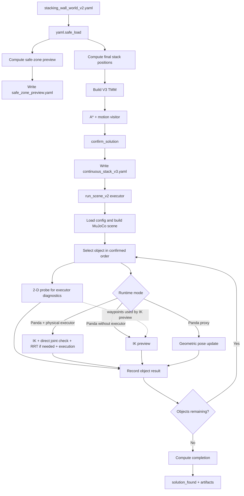
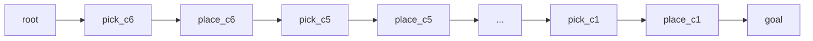

# CTAMP Robot

This repository runs a CTAMP pipeline for task planning, motion planning, 7-DOF Panda IK, and MuJoCo execution.

This README follows one concrete path. A user provides [`stacking_wall_world_v2.yaml`](configs/scenes/stacking_wall_world_v2.yaml), and the document traces that data until all six cubes have been attempted.

Sections 1-3 cover the YAML input, targets, and ordering. Sections 4-7 cover coordinate frames, planning, IK, execution, and success. Section 8 explains the TMM. Sections 9-10 cover outputs and tests.

## Three Things to Understand First

1. In the stacking scenario, the YAML still provides the stack order `c6 -> c5 -> ... -> c1`. V3 confirms that order through TMM search before execution; it does not infer cube size from geometry.
2. The 2-D motion probe and physical IK/execution are separate validation layers. Both are recorded, but physical mode uses physical execution to decide per-object success.
3. V3 builds and searches a TMM before MuJoCo execution, confirms every edge has a motion plan, then passes the confirmed order to the existing v2 executor. V1 and v2 entry points remain available.

## Run the Stacking Scenario

Preview the targets without running MuJoCo:

```bash
python3 -m cli.run_stacking_v3 \
  --config configs/scenes/stacking_wall_world_v2.yaml \
  --output runs/stacking_v3_preview \
  --dry-run
```

Run the full scenario:

```bash
python3 -m cli.run_stacking_v3 \
  --config configs/scenes/stacking_wall_world_v2.yaml \
  --output runs/stacking_v3
```

Run one cube first when checking the viewer or a fresh machine:

```bash
python3 -m cli.run_stacking_v3 \
  --config configs/scenes/stacking_wall_world_v2.yaml \
  --output runs/stacking_v3_1obj \
  --max-objects 1 \
  --viewer
```

Add `--viewer` to open the MuJoCo viewer. Use `python` instead of `python3` if that is the interpreter name on your system.

After installation, the equivalent entry point is `ctamp-run-stacking-v3`.

The previous stacking path remains callable with `python3 -m cli.run_stacking_v2` or `ctamp-run-stacking-v2`.

## PDDLStream Benchmark Arm

PDDLStream is the symbolic front-end for seeded Blocksworld and Kitchen challenges. It samples grasps, placements, IK configurations, and collision-free transit trajectories through wrappers around `PandaIKSolver`, `MotionProbe`, and `plan_joint_rrt`; accepted placement actions are then executed by the unchanged `run_scene_v2` executor.

Initialize and build the recursive dependency once:

```bash
git submodule update --init --recursive
python3 third_party/pddlstream/downward/build.py
```

Run seeded three-object dry runs without launching MuJoCo:

```bash
python3 -m cli.run_pddlstream \
  --domain blocksworld \
  --config configs/scenes/blocksworld_challenge.yaml \
  --output runs/blocksworld_pddlstream \
  --num-objects 3 \
  --seed 0 \
  --dry-run

python3 -m cli.run_pddlstream \
  --domain kitchen \
  --config configs/scenes/kitchen_challenge.yaml \
  --output runs/kitchen_pddlstream \
  --num-objects 3 \
  --seed 0 \
  --dry-run
```

Remove `--dry-run` for Panda/MuJoCo planning and execution. Each generated instance records `planning_time_seconds`, stream evaluation/sample/failure counts, and `plan_length` in `metrics.json`. `--num-objects` supports the literature sweep from 3 through 6; `--seed` selects a procedural instance. Editable source checkouts also expose `ctamp-run-pddlstream`; `--config` remains required because challenge YAMLs and the recursive PDDLStream checkout are not wheel resources.

Blocksworld uses the canonical four actions from PDDLStream's bundled example with stream preconditions. Kitchen retains the bundled example's gripper/pose/grasp/pick/place vocabulary and adds `Cleaned`, `Cooked`, `clean`, and `cook`. Kitchen emits one ordered `placement_sequence`; `run_scene_v2` executes the complete sink-to-stove sequence in one MuJoCo backend and one viewer, so each food remains in the same simulated world between placements. Blocksworld retains per-placement execution phases so measured support offsets can be propagated into later stack targets. Stream trajectories validate home-to-pick, pick-to-place, and place-to-home candidates but are not injected into `run_scene_v2`, whose executor replans physical motion.

PDDLStream's shipped fluent-stream compiler cannot certify outputs later stored in action effects. Source grasp poses and Blocksworld support-relative placements are therefore state-bound, while collision checks for other movable objects use the stream-generation scene snapshot. Every placement is revalidated by Panda IK/RRT and MuJoCo execution; no failed stream or execution phase falls back to TMM search. `run_scene_v2` still computes its legacy post-hoc linear TMM success bookkeeping, but that pass does not choose object order or replace failed motion.

`run_stacking_v3` and its `TMMAStar`, `DewantoEdgeCost`, `OnlineMeanRemainingCost`, and `StackingV3MotionVisitor` path are deprecated for benchmark use but remain callable as the custom-search reference.

Related-work note: Kwon and Kim (2026), "Kinodynamic Task and Motion Planning using VLM-guided and Interleaved Sampling," already compare PDDLStream and LLM³ on Blocksworld/Kitchen. Benchmark-paper framing must cite and distinguish that comparison, particularly its reported Kitchen scaling failures; this repository adds neither citation metadata nor claims of novelty.

## End-to-End Flow



The call chain is:

```text
cli/run_stacking_v3.py
  -> ctamp/experiments/run_stacking_v3.py
     -> ctamp/experiments/run_scene_v2.py
        -> ctamp/experiments/run_scene.py
```

`run_stacking_v3` reuses the v2 phase-config generator and v2 executor. Its new work is the pre-execution CTAMP pass: TMM construction, A* search, motion planning during expansion, Dewanto-style edge cost, online mean-cost heuristic updates, and confirmation. See [`run_stacking_v3.run()`](ctamp/experiments/run_stacking_v3.py).

`run_scene_v2` does not replace the v1 success logic. It wraps `run_scene` with `plan_xy` caching and MuJoCo batching. See [`run_scene_v2.run()`](ctamp/experiments/run_scene_v2.py#L93-L124).

## 1. YAML as the Scene Contract

The most important parts of the stacking YAML are:

```yaml
table:
  z_top: 0.80

objects:
  - {id: c1, size_xyz: [0.058, 0.058, 0.058], pose: [-0.0500, -0.5800, 0.829]}
  # ...
  - {id: c6, size_xyz: [0.098, 0.098, 0.098], pose: [0.1090, 0.3708, 0.849]}

task:
  target_objects: [c6, c5, c4, c3, c2, c1]
  preserve_order: true

physical_execution:
  completion_policy: strict
  minimum_completion_ratio: 1.0

stacking_v2:
  final_stack_xy: [-0.30, -0.75]
  final_order_bottom_to_top: [c6, c5, c4, c3, c2, c1]
```

The full source is [`configs/scenes/stacking_wall_world_v2.yaml`](configs/scenes/stacking_wall_world_v2.yaml#L1-L83).

Fields that affect the runtime flow:

| YAML field | Purpose |
|---|---|
| `objects[].pose` | Initial cube-center position in the MuJoCo world frame |
| `objects[].size_xyz` | Cube geometry and target stack height |
| `objects[].grip_target_width` | Requested gripper opening for that cube |
| `robot.base_xy/base_z` | Panda base position in the MuJoCo world |
| `robot.reach_min_xy/reach_max_xy` | Radial limits used by the 2-D MotionProbe |
| `robot.physical_start_qpos` | Initial configuration of the seven Panda joints |
| `task.target_objects` | Objects that must be attempted |
| `task.preserve_order` | Forces the runner to follow the configured order |
| `obstacles[].pose/size` | Obstacle geometry for the scene and route probe |
| `constraints.max_retries_per_object` | Maximum transfer-probe retries |
| `stacking_v2.final_stack_xy` | Shared X-Y target for every stack layer |
| `stacking_v2.final_order_bottom_to_top` | Bottom-to-top cube order |
| `physical_execution.completion_policy` | Final acceptance rule |

The initial load is intentionally simple:

```python
config = yaml.safe_load(config_path.read_text(encoding="utf-8"))
```

See [`run_stacking_v3.run()`](ctamp/experiments/run_stacking_v3.py).

The loader only converts readable YAML into Python data. Required fields are accessed later, so missing fields or unknown object names fail when the pipeline uses them.

## 2. From YAML to Safe-Zone Preview and Stack Targets

`build_phase_configs()` creates two derived configurations:

1. `safe_zone_preview.yaml`: a flat arrangement for preview and possible future fallback logic.
2. `continuous_stack_v3.yaml`: the stack target passed to the MuJoCo runner after V3 confirmation.

See [`build_phase_configs()`](ctamp/experiments/run_stacking_v2.py#L119-L147).

The safe zone is currently preview-only. V3 executes `continuous_stack_v3.yaml`, not `safe_zone_preview.yaml`.

```python
stack_path = output / "continuous_stack_v3.yaml"

continuous = run_scene_v2(
    stack_path,
    output / "continuous_stack",
    ...
)
```

See [`run_stacking_v3.run()`](ctamp/experiments/run_stacking_v3.py).

The name `safe_zone` therefore does not mean that the robot automatically moves a failed cube there.

### Safe-Zone Position Calculation

For the `x` axis, cube `i` receives:

```text
x_i = origin_x + i * spacing
y_i = origin_y
z_i = table_z + cube_height_i / 2
```

With `origin = [0.08, -0.50]` and `spacing = 0.095`, `c6` is placed at `x=0.08`, `c5` at `x=0.175`, and so on.

See [`_safe_zone_positions()`](ctamp/experiments/run_stacking_v2.py#L48-L66).

### Final Stack Position Calculation

All cubes share X-Y `[-0.30, -0.75]`. Each cube center is calculated from the available supporting surface:

```text
surface_z_0     = table.z_top
center_z_i      = surface_z_i + height_i / 2
surface_z_(i+1) = surface_z_i + height_i
```

See [`_stack_positions()`](ctamp/experiments/run_stacking_v2.py#L33-L45).

Targets generated by the default YAML:

| Order | Cube | Height | Center target `[x, y, z]` |
|---:|---|---:|---|
| 1/6, bottom | `c6` | `0.098` | `[-0.30, -0.75, 0.849]` |
| 2/6 | `c5` | `0.090` | `[-0.30, -0.75, 0.943]` |
| 3/6 | `c4` | `0.082` | `[-0.30, -0.75, 1.029]` |
| 4/6 | `c3` | `0.074` | `[-0.30, -0.75, 1.107]` |
| 5/6 | `c2` | `0.066` | `[-0.30, -0.75, 1.177]` |
| 6/6, top | `c1` | `0.058` | `[-0.30, -0.75, 1.239]` |

For example, the `c5` center height is:

```text
z_c5 = 0.80 + 0.098 + 0.090/2
     = 0.943
```

Nominally, there is no gap between the first two layers:

```text
top(c6)    = 0.849 + 0.098/2 = 0.898
bottom(c5) = 0.943 - 0.090/2 = 0.898
```

These positions are stored in `tidy_groups[].positions`. `generate_tidy_slots()` copies each position into an object-specific `GoalSlot`.

See [`generate_tidy_slots()`](ctamp/simulation/scene.py#L43-L64).

The data passed to `run_scene_v2` includes:

```yaml
task:
  target_objects: [c6, c5, c4, c3, c2, c1]
  preserve_order: true

tidy_groups:
  - id: continuous_stack
    objects: [c6, c5, c4, c3, c2, c1]
    positions:
      c6: [-0.30, -0.75, 0.849]
      c5: [-0.30, -0.75, 0.943]
      # ... through c1
```

`_phase_config()` builds this derived configuration. V3 writes it to `continuous_stack_v3.yaml`; v2 writes it to `continuous_stack.yaml`. See [`run_stacking_v2.py`](ctamp/experiments/run_stacking_v2.py#L89-L116) and [`run_stacking_v3.py`](ctamp/experiments/run_stacking_v3.py).

## 3. Object Ordering

### Stacking Uses the YAML Order

`final_order_bottom_to_top` becomes `task.target_objects`. With `preserve_order: true`, the selector always takes the first remaining object.

```python
def _next_object(pending: list[str]) -> str:
    if preserve_order:
        return pending[0]
```

See [`_next_object()`](ctamp/experiments/run_scene.py#L376-L425).

The order is:

```text
c6 largest -> c5 -> c4 -> c3 -> c2 -> c1 smallest
```

This is a **required stacking order**, not a priority discovered by the planner. The code does not sort `size_xyz`; an incorrect YAML order is still followed.

### When `preserve_order` Is Disabled

Other scenes use this score:

```text
score = transit_length + transfer_length
      + 5000 if transit fails
      + 3000 if transfer fails
      + 200 if transit is not direct
      + 200 if transfer is not direct
      + 0.01 * original_order
```

The object with the lowest score is selected. With an active Panda model, the runner also probes at most four leading candidates for a feasible grasp.

See the scoring and IK precheck in [`run_scene.py`](ctamp/experiments/run_scene.py#L383-L425).

This scoring path is inactive for the stacking YAML because `preserve_order` is `true`.

## 4. Scene Construction and Coordinate Frames

This repository does not use ROS `tf` or `tf2`. Scene poses are expressed directly in one MuJoCo world frame.

```text
robot.base_xy + robot.base_z -> link0 body position in world
objects[].pose               -> cube_<id> body position in world
obstacles[].pose             -> obstacle geom position in world
GoalSlot.position            -> target site position in world
```

See Panda placement in [`MuJoCoSceneBuilder.build_xml()`](ctamp/simulation/mujoco_scene_builder.py#L28-L62).

See obstacle, cube, and slot placement in [`mujoco_scene_builder.py`](ctamp/simulation/mujoco_scene_builder.py#L84-L164).

After the XML is loaded, `mj_forward()` computes every body and site pose. `get_body_pose()` reads `data.xpos` and `data.xquat` from MuJoCo.

See [`MuJoCoBackend.load_model()`](ctamp/simulation/mujoco_backend.py#L24-L38) and [`get_body_pose()`](ctamp/simulation/mujoco_backend.py#L49-L52).

### Relative Transform Used During Carry

A relative transform is calculated when a grasped cube must follow the hand:

```text
p_cube_in_hand = R_hand^T * (p_cube_world - p_hand_world)
R_cube_in_hand = R_hand^T * R_cube_world
```

The runtime stores this transform in the `carry_<object_id>` equality weld after bilateral finger contact has been validated.

See [`PandaPhysicsExecutor.set_carry_constraint()`](ctamp/simulation/panda_physics.py#L120-L147).

The actual flow is not `YAML -> ROS TF -> IK`. It is `world pose from YAML -> MuJoCo world target -> IK`.

## 5. Geometric Motion Planning Before IK

For each object, the runner issues two queries:

```text
transit : current_xy -> object.pose[:2]
transfer: object.pose[:2] -> GoalSlot.position[:2]
```

See [`run_scene.py`](ctamp/experiments/run_scene.py#L427-L457).

After a successful object, the 2-D planner's `current_xy` becomes the slot X-Y. This is an abstract probe state, not the physical end-effector pose. The physical arm returns to a safe or home pose.

See [`run_scene.py`](ctamp/experiments/run_scene.py#L306-L310) and [`run_scene.py`](ctamp/experiments/run_scene.py#L514-L520).

`MuJoCoMotionPlanner.plan_xy()` converts the probe result into a `MotionPlan` with status, waypoints, length, clearance, route type, and planning time.

See [`MuJoCoMotionPlanner.plan_xy()`](ctamp/motion_planning/mujoco.py#L16-L38).

### Obstacle Inflation

The wall is treated as a 2-D rectangle inflated by clearance `c = 0.055 m`:

```text
x_min = x - size_x/2 - c
x_max = x + size_x/2 + c
y_min = y - size_y/2 - c
y_max = y + size_y/2 + c
```

See [`MotionProbe._inflated_rect()`](ctamp/simulation/scene.py#L128-L138).

For the YAML wall at `[0.00, -0.08]` with size `[0.08, 0.10]`, the inflated rectangle is:

```text
x = [-0.095, 0.095]
y = [-0.185, 0.025]
```

### Route Selection

1. Try a direct line.
2. If blocked, generate candidates on both sides of the wall.
3. Reject candidates outside the table, outside reach, or intersecting the rectangle.
4. Select the shortest valid polyline.

Route length is the sum of Euclidean segment lengths:

```text
L = distance(p0, p1) + distance(p1, p2) + ...
```

See [`MotionProbe.probe()`](ctamp/simulation/scene.py#L159-L205).

### Worked Example: Transit to `c6`

Home X-Y is derived from the base, minimum reach, and a `0.02` offset:

```text
home_xy = [-0.42 + 0.25 + 0.02, -0.08]
        = [-0.15, -0.08]
```

The YAML target for `c6` is `[0.109, 0.3708]`. The direct line intersects the wall, so `left_corridor` becomes:

```text
[-0.15, -0.08]
-> [-0.15,  0.035]
-> [ 0.109, 0.035]
-> [ 0.109, 0.3708]
```

Its length is:

```text
L = 0.115 + 0.259 + 0.3358
  = 0.7098 m
```

The value `0.035` is the rectangle's upper side at `0.025` plus a `0.01` corridor margin.

See home X-Y in [`run_scene.py`](ctamp/experiments/run_scene.py#L84-L90). See the corridor calculation in [`scene.py`](ctamp/simulation/scene.py#L165-L197).

If transfer fails, `probe_transfer()` repeats the query up to `max_retries_per_object`. The geometric query is deterministic, so retries currently do not generate new candidates.

See [`probe_transfer()`](ctamp/experiments/scene_helpers.py#L54-L69).

V3 adds one pre-execution fallback only inside the CTAMP confirmation pass: if the standard 2-D probe fails, it tries X-side corridor polylines around the inflated wall. This is used to confirm the V3 TMM path; the downstream v2 executor still records its own geometric probe diagnostics.

See [`StackingV3MotionVisitor._plan_x_corridor()`](ctamp/experiments/run_stacking_v3.py).

## 6. From World Targets to IK and Joint Trajectories

The 2-D motion probe and Panda IK are different calculations.

In physical stacking, the 2-D probe supplies route diagnostics. The physical executor uses the cube's current MuJoCo pose and the goal slot to build grasp, lift, and place joint paths.

See [`_execute_physical_pick_place()`](ctamp/experiments/run_scene.py#L170-L310).

The physical path does not convert the X-Y `MotionPlan` waypoints into a joint trajectory. The geometric probe and physical IK/RRT results must therefore be treated as separate evidence.

In IK-preview mode without a physical executor, X-Y waypoints are densified and assigned a fixed Z before being passed to `solve_path()`.

```python
transit_targets = _dense_xyz(transit.waypoints, 0.95)[1:]
transfer_targets = _dense_xyz(motion.waypoints, 0.938)[1:]
```

See [`_execute_ik_preview()`](ctamp/experiments/run_scene.py#L312-L374).

### IK Calculation

The target and gripper are both expressed in the world frame. Position error is:

```text
e_pos = p_target_world - p_gripper_world
```

When orientation is supplied, rotation error is:

```text
e_rot = 0.5 * sum(cross(R_current[:, i], R_target[:, i]))
```

The combined error and Jacobian use orientation weight `0.35`:

```text
error = [e_pos; 0.35 * e_rot]
J     = [J_pos; 0.35 * J_rot]
```

The solver uses damped least squares:

```text
delta_q = J^T * inverse(J * J^T + damping * I) * error
q_next  = clip(q_current + step_size * delta_q, q_min, q_max)
```

Important defaults:

```text
tolerance      = 0.002 m
damping        = 0.002
step_size      = 0.6
max_iterations = 250
```

The `0.002 m` value is the position tolerance. With an orientation target, termination also requires `norm(e_rot) <= orientation_tolerance`.

The default orientation tolerance is `0.035 rad`. Call sites override it: lift uses `0.10`, physical pregrasp candidates use `0.35`, and the final grasp uses `0.08`.

See [`PandaIKSolver.solve()`](ctamp/simulation/panda_ik.py#L103-L175).

See per-stage tolerances in [`run_scene.py`](ctamp/experiments/run_scene.py#L198-L229) and [`plan_physical_grasp()`](ctamp/simulation/panda_ik.py#L422-L491).

If a seed fails or collides, the solver tries other seeds. A result is accepted only when the residual is small enough and the robot is collision-free.

See [`solve_collision_free()`](ctamp/simulation/panda_ik.py#L177-L224).

### Grasp, Lift, and Place

For a physical grasp, the solver tries `top`, `side_pos_x`, `side_neg_x`, `side_pos_y`, and `side_neg_y` approaches.

See [`plan_physical_grasp()`](ctamp/simulation/panda_ik.py#L422-L495).

After a grasp is found:

```text
lift_target     = gripper_position + [0, 0, 0.14]
place_target    = slot.position + [0, 0, 0.06]
preplace_target = place_target + [0, 0, 0.14]
```

See [`run_scene.py`](ctamp/experiments/run_scene.py#L198-L229).

For `c6` with a top grasp:

```text
cube_world     = [0.109, 0.3708, 0.849]
grasp_target   = cube_world + [0, 0, 0.02]
               = [0.109, 0.3708, 0.869]
pregrasp       = grasp_target - [0, 0, -1] * 0.14
               = [0.109, 0.3708, 1.009]
```

For the bottom `c6` slot:

```text
slot           = [-0.30, -0.75, 0.849]
place_target   = slot + [0, 0, 0.06]
               = [-0.30, -0.75, 0.909]
preplace       = place_target + [0, 0, 0.14]
               = [-0.30, -0.75, 1.049]
```

See the grasp-target and pregrasp calculations in [`plan_physical_grasp()`](ctamp/simulation/panda_ik.py#L422-L491).

Each Cartesian target becomes a joint candidate. If the direct joint-space segment collides, `plan_joint_rrt()` runs bidirectional RRT-Connect.

See [`solve_path()`](ctamp/simulation/panda_ik.py#L603-L679) and [`plan_joint_rrt()`](ctamp/simulation/panda_ik.py#L681-L759).

IK/RRT planning uses a MuJoCo backend separate from physical execution. Search-time `qpos` changes therefore do not move the live arm.

See backend separation in [`run_scene.py`](ctamp/experiments/run_scene.py#L111-L130).

### Physical Execution

Joint waypoints are sent to actuators with smoothstep interpolation. The number of subtargets is based on the ratio of maximum joint delta to `max_joint_step`.

Because interpolation uses smoothstep, `max_joint_step` controls the subtarget count but is not a strict upper bound on every commanded delta.

See [`follow_joint_path()`](ctamp/simulation/panda_physics.py#L85-L104).

Software accepts acquisition when:

1. The left finger touches the cube.
2. The right finger touches the cube.
3. The arm follows the lift path.
4. The cube rises by at least `0.04 m`.

See [`validate_grasp_and_lift()`](ctamp/simulation/panda_physics.py#L203-L243).

After bilateral contact, the runtime activates an equality weld before lifting. This is **contact-gated kinematic carry**, not an independent proof of force closure.

The YAML also sets `require_force_closure: false`. That field is not currently enforced as a runtime gate.

`close_gripper()` sends half of the total opening to the single-finger actuator. For `c6`, `grip_target_width=0.078` produces an actuator target of `0.039 m`.

See [`close_gripper()`](ctamp/simulation/panda_physics.py#L106-L118).

At the target, the weld is released, the gripper opens, the simulation settles, and the final cube pose is read from MuJoCo.

See placement release and measurement in [`run_scene.py`](ctamp/experiments/run_scene.py#L268-L296).

## 7. Success Criteria

### Per-Object Success

There are three per-object gates:

1. Panda + physical executor: success follows IK and physical execution.
2. Panda without a physical executor: 2-D transit, 2-D transfer, and IK preview must all succeed.
3. Panda proxy without IK: 2-D transit and transfer must succeed; the default IK value adds no physical validation.

```python
object_success = (
    execution.ik_success
    if physics_executor is not None
    else transit.success and motion.success and execution.ik_success
)
```

See [`run_scene.py`](ctamp/experiments/run_scene.py#L477-L498).

Physical execution may succeed even when the 2-D probe records `route_type: failed`. This is not a contradiction because physical IK/RRT is the primary validator in that mode.

In console logs, `geometric=False ik=True` means the coarse 2-D probe failed, but Panda IK and physical execution still succeeded.

### Whole-Stack Success

The YAML uses:

```yaml
completion_policy: strict
minimum_completion_ratio: 1.0
```

Under `strict`, all six `per_object_result[].success` values must be `true`.

See [`completion_status()`](ctamp/experiments/scene_helpers.py#L72-L92).

The final gate is:

```text
solution_found = accepted_completion AND tmm_search_success
```

See [`run_scene.py`](ctamp/experiments/run_scene.py#L521-L543).

The current software acceptance checklist is:

```text
completed_objects == 6
all_objects_solved == true
completion_ratio == 1.0
completion_policy == "strict"
failed_objects == []
continuous_stack.solution_found == true
metrics.json solution_found == true
```

### Limits of “Perfect Stacking”

`physical_tidy_success` currently checks only whether X-Y error is at most `0.07 m`:

```text
norm(placement_error_xy) <= 0.07
```

See [`run_scene.py`](ctamp/experiments/run_scene.py#L286-L296).

There is no explicit gate for Z error, cube tilt, inter-layer contact, center of mass, or tower stability after all cubes have been placed.

`solution_found=true` therefore means that the current software rules accepted the challenge. It is not formal proof of a perfectly stable tower.

The YAML `challenge.*` fields are also metadata. Obstacle behavior comes from `obstacles`, MotionProbe, IK/RRT collision checks, and physics. `side_corridors_required` is not enforced as a separate gate.

## 8. Task-Motion Multigraph

TMM means **Task-Motion Multigraph**. A vertex holds robot and workspace state. An edge holds an action, joint space, motion plan, and cost.

It is a multigraph because two vertices can have multiple parallel edges, such as alternative joint spaces for the same symbolic action.

See [`TaskMotionMultigraph`](ctamp/tmm/multigraph.py#L12-L37) and the [`Vertex`/`Edge`](ctamp/domain/models.py#L67-L82) models.

In V3, every vertex still shares one `RobotState` and one `WorkspaceState` built from the stacking YAML. `root`, `pick`, `place`, and `goal` are milestones, not full state transitions.

Fields such as `holding_object_id` and workspace poses are not updated between vertices by the V3 builder.

See [`_build_v3_tmm()`](ctamp/experiments/run_stacking_v3.py).

### When the TMM Is Built

V3 follows this order:

```text
YAML + generated stack targets
-> build V3 TMM
-> TMMAStar.search
-> StackingV3MotionVisitor plans edges during expansion
-> confirm_solution(path_edges)
-> write continuous_stack_v3.yaml with confirmed order
-> run_scene_v2 executes in MuJoCo
```

The V3 TMM pass runs before MuJoCo execution in [`run_stacking_v3.py`](ctamp/experiments/run_stacking_v3.py).

The V3 TMM confirms the configured stack order. It still does not infer the order from cube sizes and does not send joint trajectories directly to Panda; the v2 executor handles physical motion.

The v2 stacking runtime still builds an ordered TMM after the pick-place loop in [`run_scene.py`](ctamp/experiments/run_scene.py#L427-L530). That path remains available for comparison.

### V3 TMM Construction

Each object creates two vertices:

```text
pick_<object_id>
place_<object_id>
```

The six-cube graph is:



Each connection has two parallel edges:

```text
panda_xy_probe   # 2D probe joint space
panda_left_arm   # 7D Panda joint space label
```

The motion visitor sorts these alternatives by dimension and tries the 2-D probe first.

Transit edges use `current_xy -> object.pose[:2]`. Transfer edges use `object.pose[:2] -> stack slot[:2]`. The `done` edge has identical start and goal X-Y.

See [`_add_action_edges()`](ctamp/experiments/run_stacking_v3.py) and [`StackingV3MotionVisitor.on_expand()`](ctamp/experiments/run_stacking_v3.py).

For `n` objects:

```text
vertex count = 2n + 2
edge count   = 4n + 2
```

Six cubes produce `14` vertices and `26` edges.

### V3 Edge Cost

V3 assigns cost after motion planning. A successful edge stores a `MotionPlan`, sets `flag_motion_planned=true`, and gets:

```text
edge_cost = result_cost + process_cost

result_cost  = smoothness + length + clearance
process_cost = iteration + joint_space + planning_time + penalty
```

Where:

```text
iteration   = exp((attempt_index - 1) / attempt_index)
joint_space = exp(joint_space_dim / max_joint_dim)
penalty     = 0 on success
penalty     = max_smoothing_time + max_result_prediction on failure
```

The implementation records the component breakdown under `motion_plan.metadata["dewanto_cost"]`.

See [`DewantoEdgeCost.compute()`](ctamp/experiments/run_stacking_v3.py).

### A* Search

A* stores candidates in a priority queue:

```text
g_child = g_parent + edge.cost
f_child = g_child + heuristic(child)
```

The node with the smallest `f` is expanded first. Search succeeds when it reaches a `goal` vertex.

See [`TMMAStar.search()`](ctamp/search/tmm_astar.py#L122-L203).

V3 uses `OnlineMeanRemainingCost`: remaining unit steps to goal multiplied by the mean cost of successful edges seen so far. The mean updates during vertex expansion.

See [`OnlineMeanRemainingCost`](ctamp/experiments/run_stacking_v3.py).

`TMMAStar` calls `StackingV3MotionVisitor.on_expand()`. That visitor motion-plans outgoing edges, stores samples, updates cost, and updates the online heuristic on successful edges.

After search, V3 calls `confirm_solution(path_edges)`. If any path edge lacks a successful `MotionPlan`, the confirmed plan is empty and MuJoCo execution is skipped.

See [`confirm_solution()`](ctamp/planning/confirmation.py#L28-L47).

### V2 Ordered TMM

The v2 executor still builds its old ordered TMM after the object loop. It reads existing per-object motion results and costs, and does not call the motion planner from A*.

See [`build_ordered_tmm()`](ctamp/experiments/scene_helpers.py#L155-L232).

### TMM Outputs

V3 does not serialize the NetworkX graph itself. It writes a plan summary with path edges, costs, heuristic state, and learning samples:

```text
ctamp_v3_plan.json
metrics.json -> ctamp_v3
```

Important V3 fields:

```text
ctamp_v3.search_success
ctamp_v3.confirmation_success
ctamp_v3.path_edges
ctamp_v3.total_cost
ctamp_v3.heuristic.online_updates
ctamp_v3.learning_samples
```

The downstream `continuous_stack/final_plan.json` still comes from the v2 executor's physical object loop, not directly from `search_result.path_edges`.

### Generic TMM vs. Active Stacking TMM

The repository also includes generic `SymbolicTaskPlanner` and `TMMGraphBuilder` modules for expanding task and joint-space alternatives.

The stacking runners use specialized builders: V3 uses `_build_v3_tmm()` before execution, and v2 uses `build_ordered_tmm()` after execution. The generic modules should not be interpreted as selecting the order in active stacking runs.

See [`ctamp/planning/symbolic.py`](ctamp/planning/symbolic.py) and [`ctamp/tmm/builder.py`](ctamp/tmm/builder.py).

## 9. Outputs and Result Verification

A stacking run writes:

```text
runs/stacking_v3/
|-- safe_zone_preview.yaml
|-- continuous_stack_v3.yaml
|-- ctamp_v3_plan.json
|-- stacking_plan.json
|-- metrics.json
`-- continuous_stack/
    |-- final_plan.json
    |-- metrics.json
    |-- challenge_ablation.json
    |-- scene_summary.json
    `-- OBSERVATION.md
```

See wrapper outputs in [`run_stacking_v3.py`](ctamp/experiments/run_stacking_v3.py).

See scene-runner outputs in [`run_scene.py`](ctamp/experiments/run_scene.py#L569-L617).

Recommended verification order:

1. Open `stacking_plan.json` and confirm the order and Z targets.
2. Open `ctamp_v3_plan.json` and confirm `search_success`, `confirmation_success`, and `path_edges`.
3. Open `continuous_stack/metrics.json` for per-object diagnostics.
4. Check `physical_grip_success`, `physical_lift_height`, `physical_tidy_success`, and `placement_error`.
5. Confirm that `failed_objects` is empty and strict completion is `1.0`.
6. Check `solution_found` in the outer `metrics.json`.

`challenge_ablation.json` describes direct and corridor routes in the 2-D probe. It is not evidence of physical tower stability.

## 10. Automated Evidence

`test_stacking_v2_builds_placeholder_then_large_to_small_stack` verifies:

- the `c6 -> ... -> c1` order;
- active `preserve_order`;
- `c6` is larger than `c1`;
- the `c6` target is below the `c1` target;
- all six slots are generated.

See [`tests/test_migrated_pipeline.py`](tests/test_migrated_pipeline.py#L43-L70).

The golden dry-run verifies the order and the generated safe-zone and final position for `c6`.

See [`tests/test_golden_regression.py`](tests/test_golden_regression.py#L42-L60).

The V3 dry-run test verifies that TMM search, confirmation, online heuristic updates, and `continuous_stack_v3.yaml` generation work without launching MuJoCo.

See [`tests/test_stacking_v3.py`](tests/test_stacking_v3.py).

Run the relevant tests with:

```bash
python3 -m pytest -q tests/test_migrated_pipeline.py
python3 -m pytest -q tests/test_stacking_v3.py
python3 -m pytest -q \
  tests/test_golden_regression.py::test_stacking_dry_run_golden \
  -m simulation
```

The current automated tests verify ordering, target generation, and V3 CTAMP dry-run confirmation. They are not full regression tests for the physical stability of a six-cube tower.

## Other Entry Points

Grouped tidy from YAML:

```bash
python3 -m cli.run_simulation \
  --config configs/scenes/align_grouped_tidy_wall_world.yaml \
  --output runs/example_yaml
```

Grouped tidy from a Markdown context:

```bash
python3 -m cli.run_simulation \
  --context contexts/examples/align_grouped_tidy_wall_world.md \
  --output runs/example_context
```

Performance-oriented v2 path:

```bash
python3 -m cli.run_simulation_v2 \
  --config configs/scenes/align_grouped_tidy_wall_world.yaml \
  --output runs/example_v2
```

Previous stacking v2 path:

```bash
python3 -m cli.run_stacking_v2 \
  --config configs/scenes/stacking_wall_world_v2.yaml \
  --output runs/stacking_v2
```

If `--output` is omitted, the CLI writes artifacts to a timestamped directory under `runs/`.

The legacy TaskPlan/OMPL/adaptive-cache runner has been removed. The active runtime uses the `ctamp.*` modules described above.
